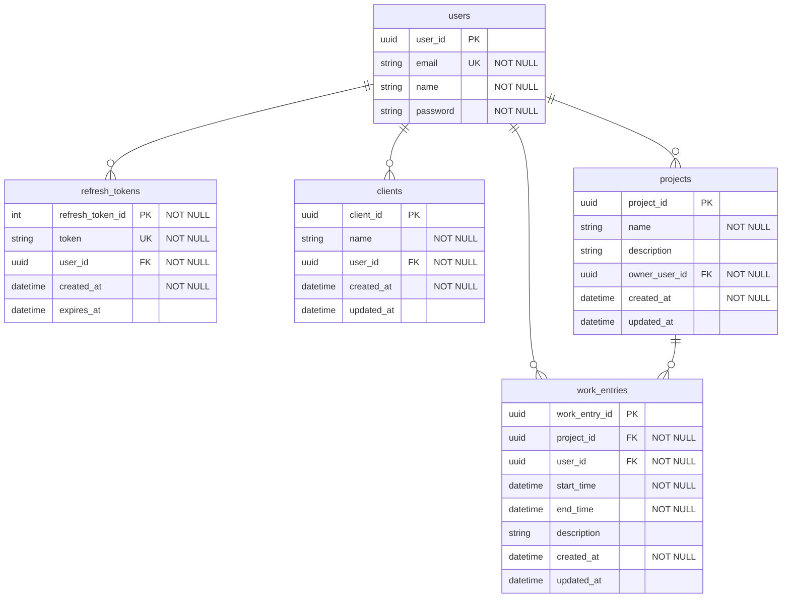

```mermaid
erDiagram
    users {
        uuid user_id PK
        string email UK "NOT NULL"
        string name "NOT NULL"
        string password "NOT NULL"
    }

    refresh_tokens {
        int refresh_token_id PK "NOT NULL"
        string token UK "NOT NULL"
        uuid user_id FK "NOT NULL"
        datetime created_at "NOT NULL"
        datetime expires_at
    }

    users ||--o{ refresh_tokens: ""

    clients {
        uuid client_id PK
        string name "NOT NULL"
        uuid user_id FK "NOT NULL"
        datetime created_at "NOT NULL"
        datetime updated_at
    }

    users ||--o{ clients:""

    projects {
        uuid project_id PK
        string name "NOT NULL"
        string description
        uuid owner_user_id FK "NOT NULL"
        datetime created_at "NOT NULL"
        datetime updated_at
    }

    users ||--o{ projects:""

    work_entries {
        uuid work_entry_id PK
        uuid project_id FK "NOT NULL"
        uuid user_id FK "NOT NULL"
        datetime start_time "NOT NULL"
        datetime end_time "NOT NULL"
        string description
        datetime created_at "NOT NULL"
        datetime updated_at
    }

    users ||--o{ work_entries:""
    projects ||--o{ work_entries:""

```
